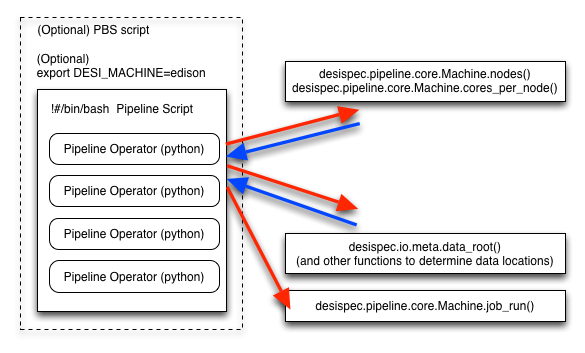

==============
Design and Use
==============

Overall Design
++++++++++++++

The goal of the desispec package is to enable the execution of spectroscopic
processing pipelines on DESI data and simulations.  The input assumptions are:

1.  There is a well defined data organizational scheme for each type of data in various steps of the processing.
2.  We have some general purpose and DESI-specific analysis tools that we want to run on the data.
3.  We want to make it "easy" to run on supercomputers and small workstations for testing.
4.  We want to make it "easy" for people to swap in new pieces of the processing for testing.

Pipeline Operators
++++++++++++++++++

A pipeline "operator" is a single processing step which takes input data,
configuration parameters, and information about the execution environment,
and produces some output.  These operators are executable scripts written in
Python, but can be simple wrappers that run other compiled and parallel code
in a given machine environment.

Pre-defined Operators
~~~~~~~~~~~~~~~~~~~~~

This package contains several ready-made operators that you can use:

desi_operator_test
    used for debugging any step of the pipeline workflow.

desi_operator_specex
    used for running specex on calibration images to produce a PSF.

desi_operator_specter
    used for simulating images or extracting spectra.

desi_operator_harp
    used for simulating images or extracting spectra.

Pipeline Scripts
~~~~~~~~~~~~~~~~

A pipeline script is simply a bash script which calls one or more pipeline
operators. It may be written by hand, or created by using one of the job setup
scripts.

Job Setup
~~~~~~~~~

On a single workstation, you should be able to simply run a pipeline script.
For setting up "standard" workflows on production supercomputers, there are
several helper scripts which build pipeline scripts and PBS submission scripts.
