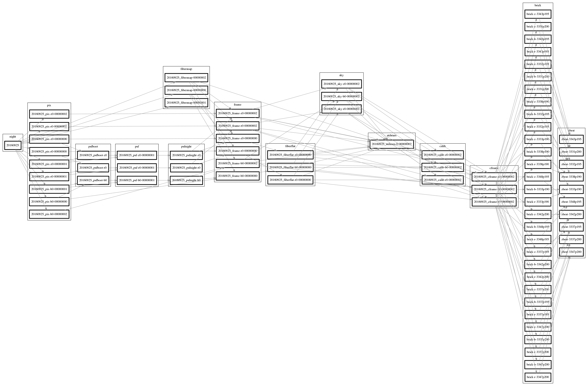
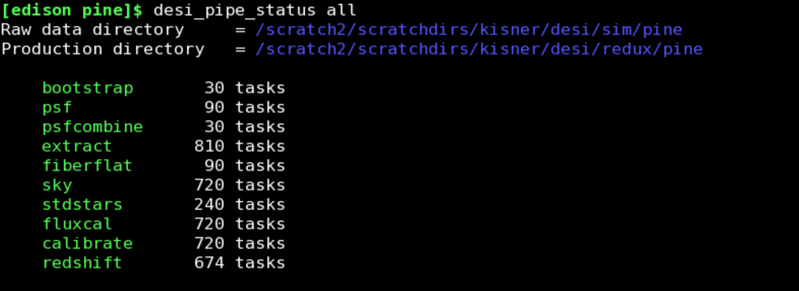
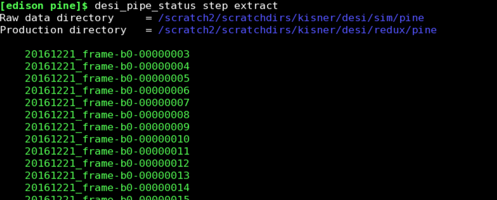
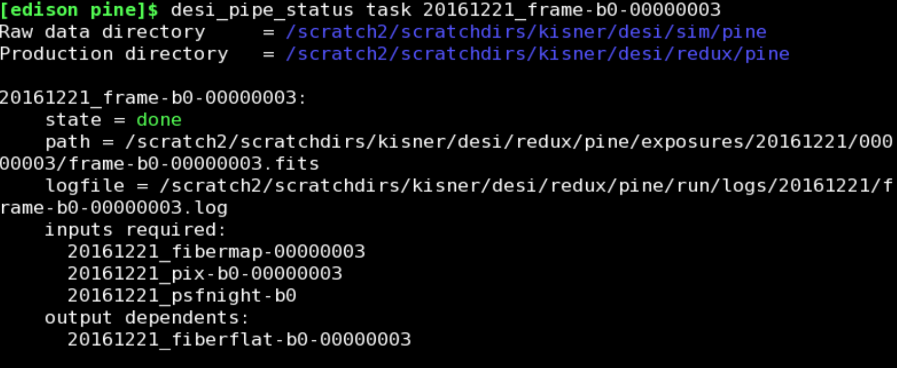
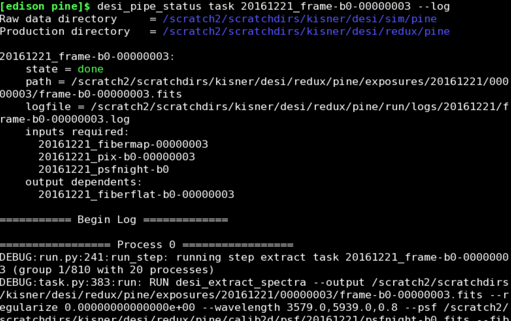

.. _pipeline:

Pipeline Use
=========================

A pipeline `production` is defined as a single processing of DESI data using a consistent software stack and set of options.  After setting up a production, the pipeline `steps` are run in order and the status of individual `tasks` are tracked.  If a task fails, all subsequent tasks which use its outputs will also fail.  If all tasks for a given step fails, the pipeline run stops.  Each task is executed by an instance of a `worker` class.  A worker can optionally use a group of MPI processes to perform a single task.  The logging output for a single task is written to a corresponding log file.  If a task fails, the traceback is logged, and additionally all relevant information needed to `retry` the task is written to disk.  While the pipeline is running the status of individual steps and tasks can be monitored from the commandline.  This monitoring tool can also be used to display the logs for a given task and retry a failed task (optionally with different options and concurrency).

.. note:: All discussion below assumes that you have loaded desispec and all dependencies into your environment by whatever means needed.  At NERSC, you must now load your environment **before** submitting any slurm scripts.

Here is an example dependency graph for one night of a very small production (3 exposures, one spectrograph):

Processing Steps
------------------------

DESI raw data (real or simulated) is organized by exposures where each exposure has up to 10 spectrographs acquiring data in 3 `bands`.  A single band from a single spectrograph is often referred to as a `frame`.  The pipeline is a chain of processing steps.  A single step has one or more individual tasks, where a task often operates on a single spectrograph, a single frame, etc.  Here is an overview of the tasks within each step and their inputs / outputs.

#.  **bootstrap** (Optional):  A single bootcalib task depends on all the arcs and flats for a single spectrograph and band for a single night (though it may only use one arc/flat for now).  The output of a bootcalib task is a `psfboot` file for the given night and frame.  This step can be skipped when creating a production, and eventually we will probably run this only when the instrument state changes in some way.

#.  **psf**:  A single specex task works on one frame and takes a psfboot file and an arc image.  It produces a `psf` file corresponding to the given arc image.

#.  **psfcombine**:  This task takes all psf files for a given night and frame and median combines them into a single `psfnight` file for that frame.

#.  **extract**:  Each of these tasks works on a single frame.  It takes the nightly psf, the image (science or flat), and the fibermap for exposure.  The task outputs a `frame` file.

#.  **fiberflat**:  A fiberflat task takes a frame file from the extraction of a flat and produces a fiberflat file.

#.  **sky**:  This produces a sky model for an extracted science frame using the "most recent" fiberflat file for the given frame.  Each task produces a sky file for the science frame.

#.  **stdstars**:  Each stdstars task works on a single spectrograph.  The inputs are the extracted science frame, the most recent fiberflat, and the sky file for each band in the given spectrograph.  The output is a stdstars file.

#.  **fluxcal**:  Each fluxcal task builds a `calib` file for a given science frame.  The inputs are the extracted science frame, the most recent fiberflat, the sky file, and the stdstars file for corresponding spectrograph.

#.  **calibrate**:  These tasks apply the calibration to a specific science frame and produce a `cframe` file.  Inputs are the science frame, the most recent fiberflat, the sky file, and the calib file.

#.  **bricks**:  This step is a single serial task which updates the brick files with the spectra contained in the cframe files.  In the pipeline scripts, this is just a call to a commandline tool.

#.  **redshift**:  This performs the redshift fitting.  Each task works on a single brick and produces a `zbest` file.

Creating a Production
-------------------------

To create a production for some raw data, we use the desi_pipe commandline tool::

    %> desi_pipe --help

.. include:: _static/desi_pipe_help.inc

The most important options are "--raw" which defines the raw data location (default is to use the ${DESI_SPECTRO_DATA} environment variable) and the "--redux" and "--prod" options which together define the location of the production (default is ${DESI_SPECTRO_REDUX}/${SPECPROD}).  When desi_pipe is used to create or update a production, it calculates the interdependencies of all data objects for each night.  This dependency graph is called a `plan`, and the nightly plans are written to the "plan" subdirectory inside the production directory.  The desi_pipe command also creates a set of daily and combined scripts in the "run/scripts" directory.  There are both slurm scripts for use at NERSC and also plain shell scripts for testing on smaller systems.

Example
~~~~~~~~~~

Let's assume we have some simulated raw data located in ${SCRATCH}/desi/raw.  We'll also assume that our data reduction directory is ${SCRATCH}/desi/redux.  Now we create a production with the first spectrograph.  We also pass in the debug option, which will enable the DEBUG logging level in all pipeline scripts::

    %> desi_pipe --debug \
        --data ${SCRATCH}/desi/raw \
        --redux ${SCRATCH}/desi/redux \
        --prod smalltest \
        --spectrographs 0

This will create the production directory structure and also make a shell snippet that we can source whenever we want to work with this production::

    %> cd ${SCRATCH}/desi/redux/smalltest
    %> cat setup.sh

    # Generated by desi_pipe
    export DESI_SPECTRO_DATA=/scratch/desi/raw
    export DESI_SPECTRO_REDUX=/scratch/desi/redux
    export PRODNAME=smalltest

    export DESI_LOGLEVEL="DEBUG"

    %> source setup.sh

Updating a Production
--------------------------

Imagine that you created a production and then additional days of data were added to the raw data location.  In order to generate scripts that include this new data, we can simply run desi_pipe again.  First, source the setup file in the production directory::

    $> source setup.sh

Then run desi_pipe with your desired options, but do **not** specify the "--raw", "--redux", or "--prod" options.  The existing production directory will be updated, and future runs of those pipeline scripts will include the new raw data.

Running a Production
-----------------------------

Now that we have used desi_pipe to set up a production, we can optionally modify the global options used for the processing and then submit the pipeline jobs to the queue or run the serial scripts.  From within the production directory, look inside the "run" directory.  Here you will find the `options.yaml` file that contains the global options for all steps of the pipeline.  Edit this file if you want something other than the defaults.  Now look in the "scripts" subdirectory.  This contains two versions of each pipeline script.  One is a slurm batch script which is designed to work at NERSC.  The other is a simple bash script which does the same tasks by calling desi_pipe_run directly.  Note that if you are using a simple cluster with MPI configured, then you can use the --shell_mpi_run and --shell_max_cores options to desi_pipe to configure these generated bash scripts to use MPI directly.

Inside the scripts directory, there are high-level shell scripts named::

    run_{slurm,shell}_{all,<night>}.sh

These scripts are used to run the pipeline on all the data or a specific night, using the slurm scheduler at NERSC or simple bash scripts.

Example
~~~~~~~~~~

Continuing with our NERSC example, let's now go and submit all the pipeline jobs.  There is a helper script which does this job submission and adds dependencies between the jobs so that they run in order.  Go into the run/scripts directory and do::

    ./run_slurm_all.sh

Now you can use the slurm commands to monitor the running state of these jobs, and you can also use the tools described in the coming sections.

Monitoring a Running Pipeline
-----------------------------------

As the pipeline runs, the state of all objects are updated in memory and at the end of each step, the updated dependency graph (with state information) is dumped to a yaml file.  The initial state is computed by traversing the file system and checking the existence of all files.  Eventually all state information like this will be read/written to a database.

As the pipeline runs, the "run/logs" subdirectory is where log files for all pipeline jobs are written.  The top level directory contains the high-level logs from each pipeline step that is run.  The nightly directories within the logs directory contain the logs from each task.  In the case of slurm jobs, the slurm script output is in a separate log file (named after the job ID), and that file contains the timestamp of the corresponding high-level log file.

Individual tasks either succeed or fail.  On success:
  - the output files are created on disk
  - the state of the pipeline is updated to reflect the success.
    Currently this state is dumped to a yaml file, but the intention
    is to write this state to a database.  The current yaml file can
    be converted to a DOT graph and made into a nice PNG.

On Failure:
  - the traceback is written to the log file for the task and a yaml file 
    containing all information about the task is written to the "run/failed" 
    directory.  You can use the desi_pipe_status tool to get more 
    information about a failed task.
  - the state of this pipeline step is updated to reflect the failure.  
    This is written to a yaml file after each step, but it will eventually 
    update a database.

Rather than manually searching through log files, it is easy to use the desi_pipe_status commandline tool to query the state of a production.  Before using desi_pipe_status, source the `setup.sh` file in the production directory you want to work with.  Then we can use one of the subcommands::

    %> desi_pipe_status --help

.. include:: _static/desi_pipe_status_help.inc

More help about each of the commands is available by running::

    %> desi_pipe_status <command> --help

Example
~~~~~~~~~~~~~~

Let's say that we have run our high level script that submits the slurm jobs, and we want to check on its status.  First we make sure that we are working with the correct production::

    %> source ${SCRATCH}/desi/redux/pine/setup.sh

To get an overview of all pipeline steps, we do:

The color of each step indicates whether it has not started (white), is in-progress (yellow), has succeeded (green), or has failed (red).  The output above indicates that all steps have succeeded.  Let's look into the extraction step in more detail:

Here we see the list of individual tasks run as part of that step, as well as their status (based on the text color).  Let's get more detail about one of the tasks:

We can also dump out the log from this task:

Debugging Failures
-------------------------

Sometimes tasks fail due to problems with the input data files or the code that processes a given step.  For debugging, first use desi_pipe_status to find a task that failed and use the "--log" option to look at the log outputs (including the traceback).  If you want to test just that task that failed, start an interactive session (preferably with the same number of MPI processes that were originally used)::

    %> salloc <options to specify number of nodes, etc>

Now use desi_pipe_status to "retry" the task::

    %> srun -n 20 desi_pipe_status task 20161221_frame-b0-00000003 --retry

You can also pass a new set of options to this retry command (as a yaml file) which will override the options that were used in the original run.

If the DEBUG log level is enabled, the log for a given task also prints the serial commandline script (and options) which can be used to run the task.  This is convenient for debugging smaller processing tasks, but may be impractical for larger ones.

